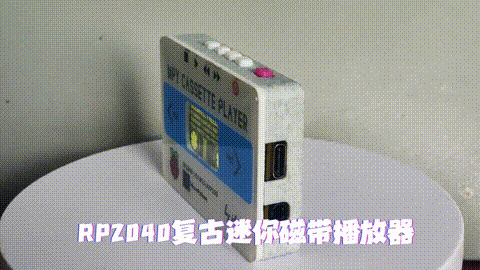
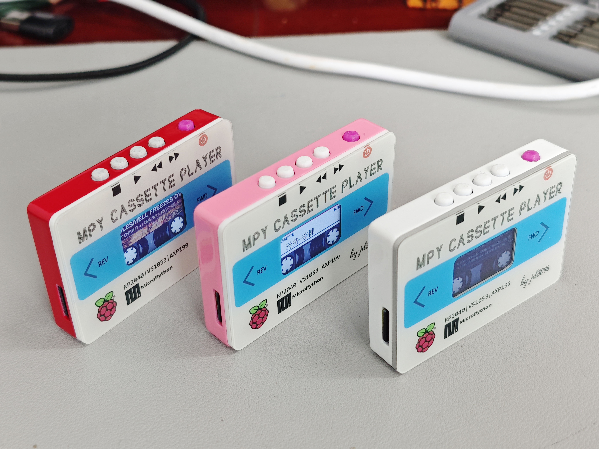

# MPY-CASSETTE-PLAYER

2023年最后一个项目啦，今年尝试了画PCB和3d建模，已经达到了HELLO WORLD水平，可喜可贺！

可识别的封面需要手动添加，主打一个情怀，分辨率要求240x75，添加工具也在文件夹工具脚本下面

img下所有素材都是我用ps一点一点抠的

首发DF论坛，参加树莓派活动！

## 按键功能简介

*按住STOP键，再按POWER键开机则进入boot下载模式，可直接拖拽UF2下载固件*

|      | STOP     | PLAY          | N/V+     | N/V-     | POWER    |
| ---- | -------- | ------------- | -------- | -------- | -------- |
| 短按 | 暂停     | 播放          | 有声快进 | 无声快退 | 屏幕开关 |
| 中按 |          | 切换封面/歌名 | 音量加   | 音量减   | 关机     |
| 长按 | 歌曲选择 | 设置菜单      | 下一首   | 上一首   | 硬关机   |

## 引脚分布

| 引脚名称                 | GPIO |
| ------------------------ | ---- |
| xcs（VS1053）            | 20   |
| x_reset（VS1053）        | 21   |
| xdcs（VS1053）           | 26   |
| dreq（VS1053）           | 27   |
| sck（VS1053和tf卡公用）  | 18   |
| mosi（VS1053和tf卡公用） | 19   |
| miso（VS1053和tf卡公用） | 16   |
| cs（tf卡）               | 17   |
| reset（屏幕）            | 9    |
| cs（屏幕）               | 7    |
| dc（屏幕）               | 8    |
| bl（屏幕）               | 6    |
| sck（屏幕）              | 10   |
| mosi（屏幕）             | 11   |
| next（按键）             | 14   |
| prev（按键）             | 15   |
| play（按键）             | 4    |
| mode（按键）             | 5    |
| SCL（AXP199）            | 1    |
| SDA（AXP199）            | 0    |
| IRQ（AXP199）            | 2    |

## 重点的技术突破

- 自己学了mp3的编码格式，码率，ID3信息，专辑封面都能自由获取
- 感谢老李eggfly的神级助攻，画了精致的pcb并且通过修改源码让mpy文件系统支持了中文，牛哇！
- 细挖了st7789的驱动库，有个类似精灵的方法，可以在不费内存的情况下保持高速刷屏，很关键，内存终于不紧张了！
- m0dular帮重做了外壳，果然结构科学多了，致敬!

